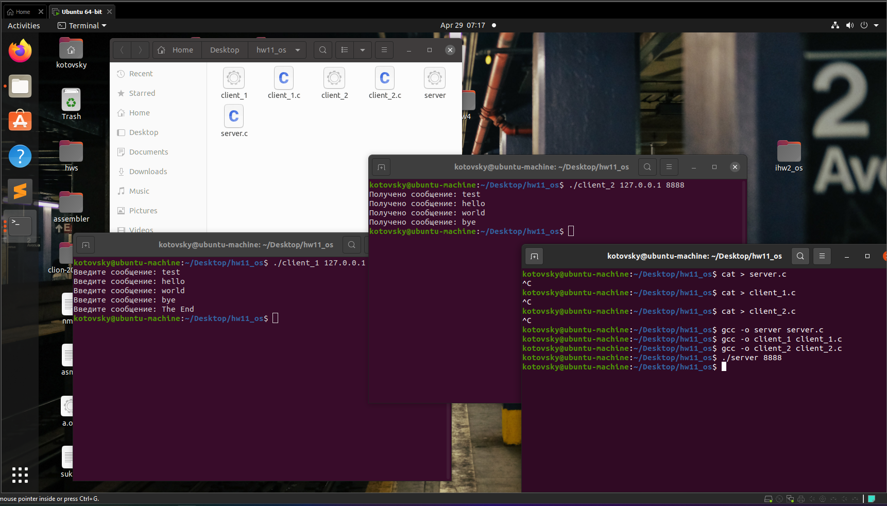

# Домашнее задание №11. Операционные системы
### Выполнил Кототвский Семён Олегович, БПИ-219.
### Отчет о работе программы
### Задача

Разработать клиент-серверное приложение, использующее TCP/IP и реализующее следующие взаимодействия: клиент №1 передает сообщения серверу, который перенаправляет их клиенту №2. В качестве исходных данных задавать: IP-адрес сервера, порт сервера. Эти данные можно задавать либо в командной строке, либо с использованием функций стандартного ввода. Передаваемое сообщение задается из стандартного ввода в цикле. То есть, можно передать не одно а несколько сообщений от клиента №1 клиенту №2. При передаче сообщения «The End» необходимо завершить работу как клиентов, так и сервера. Приложение должно функционировать в конфигурациях от одного до трех компьютеров с различными комбинациями размещения клиентов и сервера.
Описание программы:

Программа состоит из трех частей: сервера, клиента №1 и клиента №2. Сервер принимает сообщения от клиента №1 и пересылает их клиенту №2, используя протокол TCP/IP.
Сервер (server.c)

Сервер создает сокет, связывает его с адресом и портом, указанными пользователем, и начинает слушать входящие соединения. При подключении клиента №1, сервер создает отдельный сокет для этого соединения и начинает обрабатывать сообщения от клиента №1.

При подключении клиента №2, сервер создает еще один отдельный сокет и начинает пересылать сообщения от клиента №1 клиенту №2. Если получено сообщение "The End", сервер закрывает соединение с клиентами и завершает работу.
Клиент №1 (client1.c)

Клиент №1 создает сокет и подключается к серверу, используя указанный IP-адрес и порт. Затем клиент №1 считывает сообщения из стандартного ввода и отправляет их серверу. Если отправлено сообщение "The End", клиент №1 закрывает соединение и завершает работу.
Клиент №2 (client2.c)

Клиент №2 создает сокет и подключается к серверу, используя указанный IP-адрес и порт. Затем клиент №2 ожидает сообщения от сервера и выводит их на экран. Если получено сообщение "The End", клиент №2 закрывает соединение и завершает работу.
Компиляция программы:

```
gcc server.c -o server
gcc client1.c -o client1
gcc client2.c -o client2
```

Запуск программы:

Запустите сервер, указав порт, например, 8888:

```
./server 8888
```

Запустите клиент №1, указав IP-адрес сервера и порт. Если сервер и клиенты находятся на одном компьютере, используйте IP-адрес 127.0.0.1:

```
./client1 127.0.0.1 8888
```

Запустите клиент №2, указав IP-адрес сервера и порт. Если сервер и клиенты находятся на одном компьютере, используйте IP-адрес 127.0.0.1:

```
./client2 127.0.0.1 8888
```

Программа должна работать корректно в разных конфигурациях: на одном компьютере или на разных компьютерах с различными комбинациями размещения клиентов и сервера. Во время работы программы пользователь может вводить сообщения в терминале клиента №1, которые будут отправляться клиенту №2 через сервер. При отправке сообщения "The End" клиенты и сервер завершат работу.
Пример работы программы:

Запустите сервер в одном терминале:

```
$ ./server 8888
```

Запустите клиент №1 в другом терминале:

```
$ ./client1 127.0.0.1 8888
```

Запустите клиент №2 в третьем терминале:

```
$ ./client2 127.0.0.1 8888
```

Введите сообщение в терминале клиента №1.

Сообщение будет отправлено серверу и перенаправлено клиенту №2. Клиент №2 выведет полученное сообщение:

Отправьте сообщение "The End" из клиента №1. Клиенты и сервер завершат работу.

### Пример работы программы:
